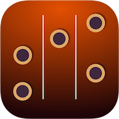
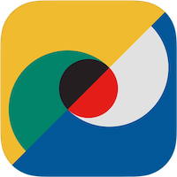
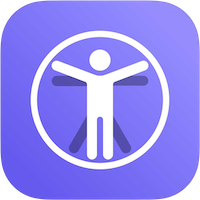

### Personal Apps
<table>
  <tr>
    <td>
      
    </td>
    <td align="center">
      <strong>What Chord?</strong> 
      

      
    </td>
    <td>
      
    </td>
    <td align="center">
      <strong>MyOutlay Lite</strong> 
      

      
    </td>
  </tr>
  <tr>
    <td>
      
    </td>
    <td align="center">
      <strong>Party Spinner</strong> 
      

      
    </td>
    <td>
      
    </td>
    <td align="center">
      <strong>Shooters: Cocktails Handbook</strong> 
      

      
    </td>
     <td>
      
    </td>
    <td align="center">
      <strong>VitalMetric</strong> 
      

      
    </td>
  </tr>
</table>

<!--
**IgnatovPasha/IgnatovPasha** is a ✨ _special_ ✨ repository because its `README.md` (this file) appears on your GitHub profile.

Here are some ideas to get you started:

- 🔭 I’m currently working on ...
- 🌱 I’m currently learning ...
- 👯 I’m looking to collaborate on ...
- 🤔 I’m looking for help with ...
- 💬 Ask me about ...
- 📫 How to reach me: ...
- 😄 Pronouns: ...
- ⚡ Fun fact: ...
-->
